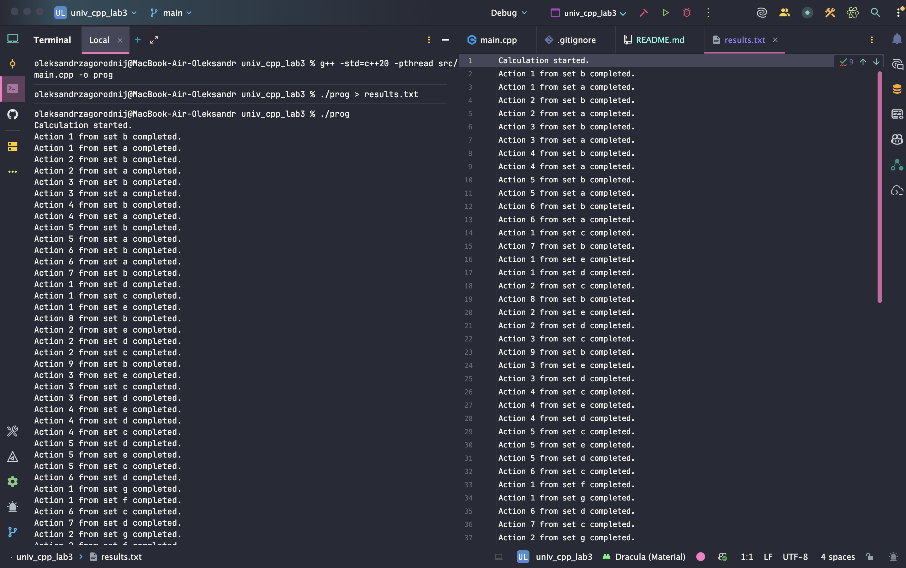
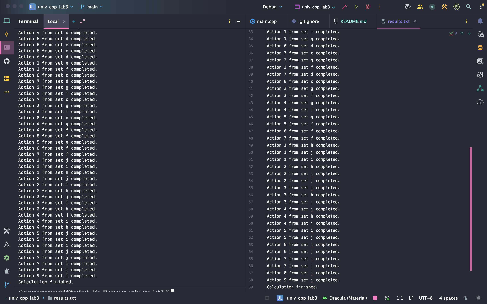

# Multithreaded Workflow Simulation

This project simulates a dependency-based computational graph using C++20 multithreading. It manages task execution order using `std::barrier` and `std::latch`, while `std::mutex` is employed for thread-safe output synchronization (replacing `std::osyncstream` due to current macOS compiler limitations).
## Task Distribution

The workflow is hardcoded to optimize execution time (makespan) by balancing the load across threads.

| Step | Thread 1 | Thread 2 | Thread 3 | Thread 4 |
| :--- | :---: | :---: | :---: | :---: |
| **1** | **`a`** | **`b`** | *wait(a)* | *wait(a)* |
| **2** | **`c`** | *wait(e)* | **`d`** | **`e`** |
| **3** | *wait* | **`f`** | *wait* | **`g`** |
| **4** | *wait* | **`h`** | **`j`** | - |
| **5** | **`i`** | - | - | - |

## Usage

### Build
```bash
g++ -std=c++20 -pthread src/main.cpp -o prog
./prog > results.txt
```

### Run example



---



---